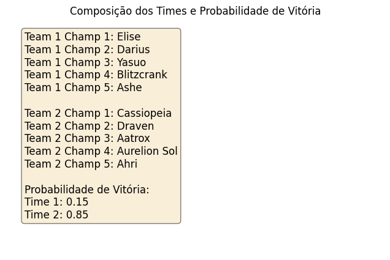

# Prevendo Vitórias em League of Legends com Regressão Logística Múltipla 🏆🎮

Este projeto utiliza Regressão Logística Múltipla para prever a probabilidade de vitória de um time no jogo *League of Legends* (LoL), utilizando campeões da Season 11. As previsões são baseadas na composição de 5 campeões para cada time e no tempo total da partida.

## 📂 Arquivos Principais
- **`s11.csv`**: Dataset contendo os dados das partidas, incluindo a composição de campeões e o resultado da partida.
- **`Sorted_Champions.csv`**: Lista de todos os campeões da Season 11, ordenados alfabeticamente.

## 🚀 Funcionamento do Projeto

### Etapas do Desenvolvimento:

1. **Carregamento e Pré-processamento**: Os dados são carregados a partir do arquivo `s11.csv`, e a duração da partida é convertida para minutos. A composição dos times é codificada usando *one-hot encoding*.
   
2. **Treinamento do Modelo**: Utiliza-se o algoritmo de Regressão Logística para treinar o modelo, ajustando pesos para balancear as classes (vitória/derrota).
   
3. **Predição e Visualização**: O modelo prevê a probabilidade de vitória para o Time 1 e o Time 2 com base na composição e tempo de jogo, exibindo um gráfico com as probabilidades.

4. **Importância das Features**: Um gráfico adicional é gerado mostrando as 10 features mais importantes que influenciam o resultado da partida.

## 🧠 Tecnologias Utilizadas
- **Python**: Para processamento de dados e implementação do modelo.
- **Bibliotecas**: 
  - `pandas` e `numpy` para manipulação dos dados.
  - `LogisticRegression` da `scikit-learn` para o modelo de classificação.
  - `matplotlib` e `seaborn` para visualização dos gráficos.

## 📊 Gráficos Gerados

### 1. Probabilidade de Vitória 🎯

Este gráfico exibe a composição dos times e as probabilidades previstas de vitória. O exemplo abaixo usa as seguintes composições:

- **Time 1**: Elise, Darius, Yasuo, Blitzcrank, Ashe
- **Time 2**: Cassiopeia, Draven, Aatrox, Aurelion Sol, Ahri

Com uma duração de jogo de 30 minutos, o gráfico mostra a chance de vitória de cada time.

### 2. Importância das Features 🛠️

Aqui estão as 10 features mais importantes que influenciam o modelo. O tempo de jogo e alguns campeões se destacam como os maiores contribuintes para a probabilidade de vitória.

## 📈 Acurácia do Modelo
Nos testes realizados, o modelo alcançou uma acurácia de **59.70%**, um resultado promissor dado o desequilíbrio nos dados de vitória/derrota.

## 🤝 Contribuições
Contribuições são bem-vindas! Sinta-se à vontade para abrir issues ou enviar pull requests.

## 🏅 Créditos

Este projeto foi desenvolvido com a colaboração de uma equipe de grandes invocadores! 🌟

- **Caio Silveira Guimarães** 🧠✨
- **Gustavo Martins Gripaldi** 🎮💡
- **Giovanna Monteiro Bispo** 🔍🎯
- **Mariana Monteiro Bispo** 💻🔥
- **Mayron Malaquias Oliveira** ⚡🎨

Cada membro contribuiu com seu talento e habilidades, garantindo que este projeto fosse não apenas tecnicamente preciso, mas também inovador e divertido!

---

